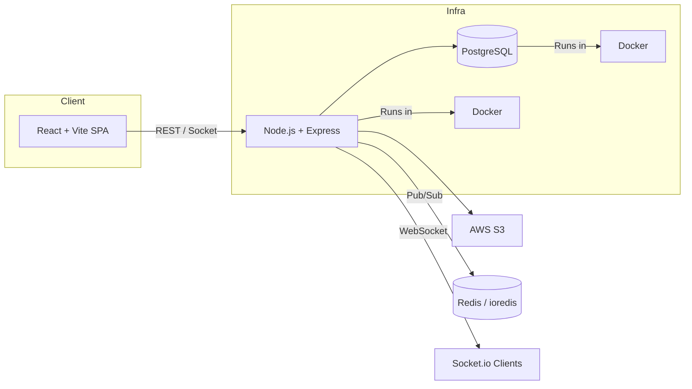

# Content Broadcasting System

Professional README — recruiter-focused summary, setup, and docs

**Project Overview**

This Content Broadcasting System is an educational platform backend and frontend built to schedule, approve, and broadcast classroom content in real time. It includes role-based workflows (Principal, Teacher, Student), content approval pipelines, scheduled broadcasts, polls, and real-time updates via WebSockets.

**Why it matters (for recruiters)**
- Built for scale and real-time responsiveness using `socket.io` and Redis.
- Secure, standards-based auth and validation (JWT, bcrypt, Joi/express-validator).
- Container-ready: production Dockerfiles and `docker-compose` for repeatable deployment.
- Designed with clear separation of concerns: controllers, services, and middlewares.

**Features**

- Role-based access control: Principal/Teacher/Student flows.
- Content upload and S3-backed storage with approval workflow.
- Scheduled broadcasts and live feed per teacher/subject.
- Real-time polls and live results with persistent votes.
- Input validation, rate limiting, and basic security hardening.
- DB migrations/seeding scripts and sample test utilities.

**Architecture Diagram**



**Tech Stack**

- Backend: Node.js, Express, Sequelize
- Real-time: socket.io, socket.io-client
- Database: PostgreSQL (pg, pg-hstore)
- Caching/Coordination: Redis (`ioredis` / `redis`)
- File storage: AWS S3 (`aws-sdk`, `multer-s3`)
- Auth & Security: `jsonwebtoken`, `bcrypt`, `express-rate-limit`, `validator`
- Validation: `joi`, `express-validator`
- Frontend: React, Vite, Tailwind CSS, Axios, React Router
- Dev tooling: Docker, docker-compose, Nodemon, ESLint

**Database Schema (high level)**

- `User` — id, name, email, password_hash, role(enum: principal, teacher, student), createdAt, updatedAt
- `Content` — id, title, description, s3_key, teacherId(FK->User), subject, status(enum: pending, approved, rejected), scheduledAt, createdAt
- `Approval` — id, contentId(FK), principalId(FK->User), decision(enum), notes, decidedAt
- `Poll` — id, question, options(json), createdBy(FK->User), startsAt, endsAt
- `Vote` — id, pollId(FK), userId(FK->User), choice, createdAt

See `src/models` for Sequelize model definitions.

**API Documentation (selected endpoints)**

- Authentication
	- `POST /api/auth/register` — body: `{name,email,password,role}`
	- `POST /api/auth/login` — body: `{email,password}` -> returns `{ token }`

- Content
	- `POST /api/content/upload` (teacher) — multipart/form-data: `file`, `title`, `subject`, `scheduledAt`
	- `GET /api/content/my-content` (teacher)
	- `GET /api/content/public` (public feed)

- Approval (principal)
	- `GET /api/approval/pending` — list pending content
	- `PATCH /api/approval/:id/approve` — body: `{notes}`

- Polls
	- `POST /api/polls` — create poll
	- `POST /api/polls/:id/vote` — cast vote (requires auth)

Authentication: send `Authorization: Bearer <token>` header for protected routes.

For full route list and request/response examples see `src/routes` and controller JSDoc comments.

**Deployment Guide**

Prerequisites: Docker (or Node 18+), PostgreSQL, Redis, AWS credentials (S3)

Quick local (Node)

```bash
git clone <repo>
cd content-broadcasting-system
cp .env.example .env
# update .env with DB, REDIS, S3, JWT_SECRET
npm install
node scripts/seed.js   # optional
npm run dev
```

Docker (recommended)

```bash
docker-compose up --build
# API: http://localhost:3000
# Frontend: http://localhost:5173
```

Key environment variables

- `DATABASE_URL` or `DB_HOST, DB_USER, DB_PASS, DB_NAME`
- `REDIS_URL`
- `AWS_ACCESS_KEY_ID`, `AWS_SECRET_ACCESS_KEY`, `S3_BUCKET`
- `JWT_SECRET`

**Screenshots**

- Add screenshots to `/readme_files/` and reference them here. Example:


If you want, I can capture sample screenshots and add them to `readme_files/`.

**Demo Credentials**

- Principal: `principal@example.com` / `Password123!`
- Teacher: `teacher@example.com` / `Password123!`
- Student: `student@example.com` / `Password123!`

These are seeded in `scripts/seed.js` (adjust passwords and env as needed).

**Testing & Utilities**

- Manual test scripts: `test-auth.js`, `test-db.js`, `test-s3.js`, `test-supabase.js`.
- Run linter: `cd frontend && npm run lint` and `npm run lint` in root where configured.

**Notes for Recruiters / Technical Reviewers**

- Architecture supports horizontal scaling: stateless API + Redis for pub/sub and session caching.
- Storage separation via S3 keeps the app lightweight and cost-efficient for media.
- Areas for improvement: add automated tests (unit/integration), CI for migrations, and granular RBAC rules.

---

If you'd like, I can:
- Add screenshots into `readme_files/` and embed them.
- Generate OpenAPI (Swagger) docs for all routes.
- Produce a short demo video and attach it to this repo.

